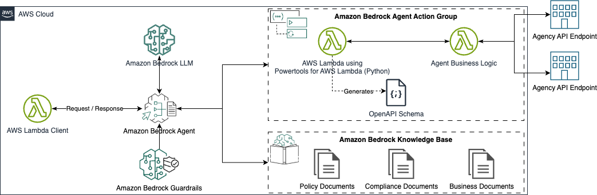

# Amazon Bedrock Agents for Public Sector

## Table of Contents
- [Introduction](#introduction)
- [Solution Architecture](#solution-architecture)
- [Prerequisites](#prerequisites)
- [Getting Started](#getting-started)
- [Quick Start](#quick-start)
- [Deploying the Solution](#deploying-the-solution)
- [Usage Guide](#usage-guide)
- [Testing](#testing)
- [Clean Up](#clean-up)
- [Contributing](#contributing)
- [Security](#security)
- [License](#license)

## Introduction
This repository is designed for public sector organizations and government agencies aiming to leverage real-time data with generative AI capabilities to enhance their operations and services. 

### Overview
The repository provides a set of example Amazon Bedrock Agents tailored for public sector use cases. These agents are built using [AWS CDK](https://aws.amazon.com/cdk/) and [Powertools for AWS Lambda (Python)](https://docs.powertools.aws.dev/lambda/python/latest/) to help accelerate developer velocity.

### How to Use This Repository
1. **Clone the Repository**: Start by cloning the repository to your local machine.
2. **Set Up Your Environment**: Ensure you have the necessary prerequisites installed and configured.
3. **Deploy the Solution**: Use the provided scripts to deploy the AWS CDK stacks.
4. **Test the Agents**: Utilize the included test suite to verify the functionality of the agents.
5. **Usage**: Refer to the Usage Guide for detailed information on each agent, including descriptions, use cases, and example prompts.

### Testing with Pytest
This solution uses Pytest for testing due to its popularity and ease of use. Pytest offers a testing framework that simplifies the process of validating basic prompt responses. 

For manual testing of the agents, use the Amazon Bedrock Management Console.

## Solution Architecture


## Prerequisites
Before you begin, ensure you have the following installed and configured:
- AWS CLI V2 with necessary IAM permissions
- AWS CDK V2
- Python 3.11
- Docker service running

## Getting Started
Clone the repository using the following command:
```bash
git clone https://github.com/aws-samples/public-sector-bedrock-agents
```

## Quick Start
After cloning the repository, you can quickly start with an Example Agent that returns weather information by running the following commands:
```bash
source ./setup.sh public-sector-llm-agent-tools/ExampleAgentStack
cd tests
pytest -v -k ExampleAgent
```

Alternatively, you can test the Example Agent via the test window in the Amazon Bedrock Management Console.

## Deploying the Solution
To deploy the solution, run the setup script:
```bash
source ./setup.sh
```

To deploy a specific Agent, provide the AgentStack name from a CDK stack within `deployment/cdk/agent_stacks`:
```bash
source ./setup.sh public-sector-llm-agent-tools/my-stack-name
```

## Usage Guide
The following is a summary of the Amazon Bedrock Agents included in this solution:

### AWSArtifactAgent
- **Description:** Provides functions to interact with [AWS Artifact](https://aws.amazon.com/artifact/) reports.
- **Example Use Cases:** Compliance and Regulatory Audits, Risk Assessment and Security Evaluation.
- **Example User Prompts:**
  - Does AWS have any recent compliance documents related to FedRAMP?
  - Provide the names of any compliance documents related to running Canadian cloud workloads.
  - Download the HITRUST Certification Letter.

### DateTimeAgent
- **Description:** Provides various date, time, and calendar-related utility functions.
- **Example Use Cases:** Government Project Management, Education Scheduling, Healthcare Appointment Tracking, Legal Compliance, Infrastructure Maintenance Planning.
- **Note:** Be sure to sync the Bedrock KnowledgeBase. (``` ./scripts/start_ingestion_jobs.sh DateTimeAgent ```)
- **Example User Prompts:**
  - Calculate the number of business days between 2026-05-01 and 2026-05-15.
  - Is Any Company's Investment Policy still valid as of today?
  - Check if the TLS certificate for amazon.com has expired.

### GeolocationAgent
- **Description:** Provides functions to interact with geolocation services using [Amazon Location Service](https://aws.amazon.com/location/).
- **Example Use Cases:** Urban Planning, Infrastructure Development, Transportation Planning and Logistics.
- **Note:** Make sure you have IAM access to Amazon Location Services.
- **Example User Prompts:**
  - Reverse geocode the coordinates (33.979878,-117.401904) to assist in dispatching firefighting crews to a reported brush burn incident.
  - Get the coordinates for the address 950 NW Carkeek Park Rd., Seattle, WA 98177, to assess its proximity to nearby green spaces for natural resource management.
  - The city is planning a walking parade route in Seattle, WA. The route starts at the Amazon Spheres and ends at the Space Needle, what are the estimated walking and driving times?

### WeatherForecastAgent
- **Description:** Utilizes the [National Weather Service (NWS) API](https://www.weather.gov/documentation/services-web-api) to access up to five days of weather forecasts and weather data.
- **Example Use Cases:** Emergency Preparedness and Response Planning, Public Event Planning and Management, Infrastructure Maintenance and Repair Scheduling, Public Transportation Operations.
- **Example User Prompts:**
  - What is the expected rainfall amount for the next 72 hours in Seattle, WA?
  - Forecast the temperature and wind conditions for tomorrow morning to plan pesticide spraying in Nashville, TN.
  - Check if there are any severe weather advisories issued for the next 48 hours that may impact road maintenance crews in Herndon, VA.

## Testing
For manual testing, use the test window in the Amazon Bedrock Management Console.

To programmatically test all the Amazon Bedrock Agents in the Usage Guide:
```bash
cd tests
pytest -v
```

To programmatically test a single Amazon Bedrock Agent in the Usage Guide:
```bash
cd tests
pytest -v -k {AGENT-NAME}
```

**Note:** Rate limiting may occur during automated testing.

## Clean Up
To delete the CDK stacks and remove associated resources, use the following command:
```bash
cd ./deployment/cdk
cdk destroy --all
```

To delete a specific CDK stack and remove associated resources, use the following command:
```bash
cd ./deployment/cdk
cdk destroy public-sector-llm-agent-tools/my-stack-name
```

## Contributing
We welcome community contributions! Please see [CONTRIBUTING.md](CONTRIBUTING.md) for guidelines.

## Security
See [CONTRIBUTING](./CONTRIBUTING.md#security-issue-notifications) for more information.

## License
The contents of this solution are licensed under the [MIT-0 License](./LICENSE).